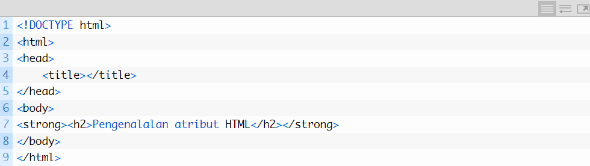
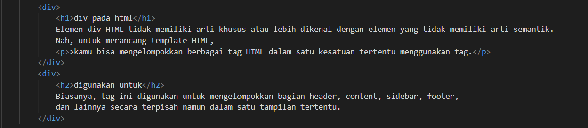
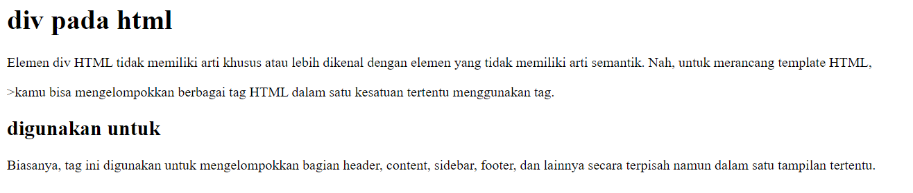

# Tugas Pemograman Web
## Apa itu HTML
HTML ( HyperText Markup Language ) itu adalah sebuah bahasa yang menggunakan markup atau penanda
untuk membuat halaman web. Penanda atau markup ini nanti akan kita sebut dengan Tag.
HTML berperan untuk menentukan struktur konten dan tampilan dari sebuah web.

## cara menambahkan Elemen HTML
Elemen pada HTML merupakan nama tag atau isi dari tag yang berada diantara tag pembuka dan penutup

## Elemen div
Penggunaan div ditujukan untuk memudahkan aplikasi bergaya dengan CSS dan memperlakukan
secara khusus yang nantinya dapat diberi Class, ID, Title, dan sebagainya.

code dalam html : 

 

Tampilan setelah dijalankan :
 

