# Tugas Pemograman Web
## Apa itu HTML
HTML ( HyperText Markup Language ) itu adalah sebuah bahasa yang menggunakan markup atau penanda
untuk membuat halaman web. Penanda atau markup ini nanti akan kita sebut dengan Tag.
HTML berperan untuk menentukan struktur konten dan tampilan dari sebuah web.

## cara menambahkan Elemen HTML
Elemen pada HTML merupakan nama tag atau isi dari tag yang berada diantara tag pembuka dan penutup

## Elemen div
Penggunaan div ditujukan untuk memudahkan aplikasi bergaya dengan CSS dan memperlakukan
secara khusus yang nantinya dapat diberi Class, ID, Title, dan sebagainya.

Tampilan code dalam html : 

 

Tampilan setelah dijalankan :
 

## Cara menambahkan elemen image
Tampilan code dalam html : 

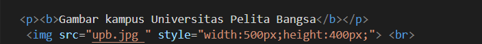 

Tampilan setelah dijalankan : 

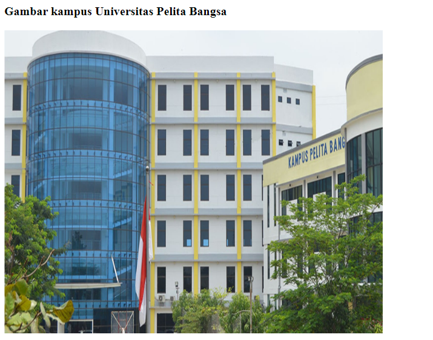 

## Menambahkan elemen input dan break elemen
Tampilan code dalam html : 

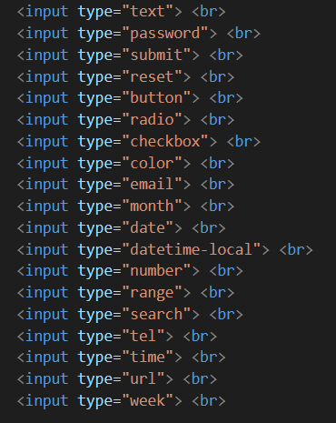 

Tampilan setelah dijalankan :
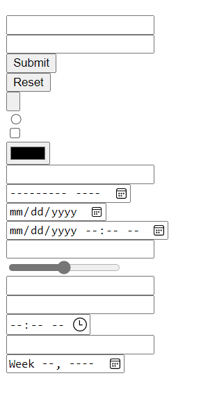 

## Menambahkan attribut
Tampilan code dalam html : 

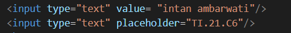 

Tampilan setelah dijalankan :
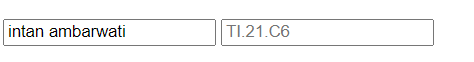 

## Menambahkan elemen fieldset,legend
Tampilan code dalam html : 

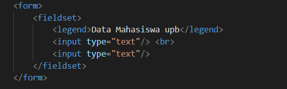 

Tampilan setelah dijalankan :
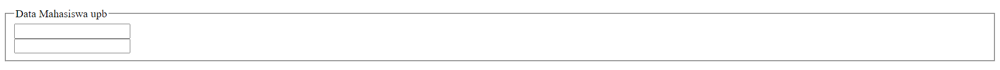 

## Menambahkan elemen select,option
Tampilan code dalam html : 

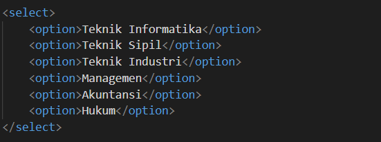 

Tampilan setelah dijalankan :
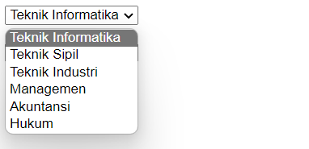 

## Elemen Optgroup
Tampilan code dalam html : 

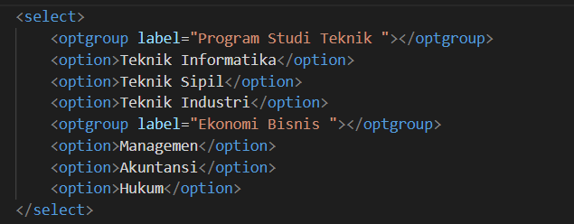 

Tampilan setelah dijalankan :
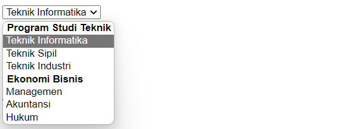 

## Formating
Tampilan code dalam html : 

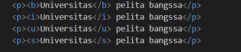 

Tampilan setelah dijalankan :
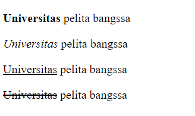 

## Cara menambahkan link pada HTML
Tampilan code dalam html : 

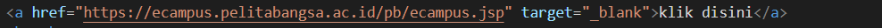 

Tampilan setelah dijalankan :
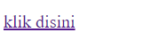 

Dan akan mengarah ke website seperti dibawah ini : 

 

## Cara menambahkan elemen iframe pada web, youtube dan mapss di google
Tampilan code dalam html : 

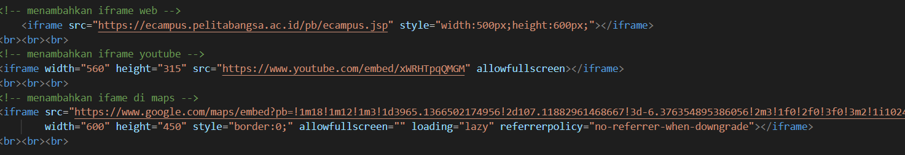 

Tampilan setelah dijalankan :
 

##  Menambahkan Textarea
Tampilan code dalam html : 

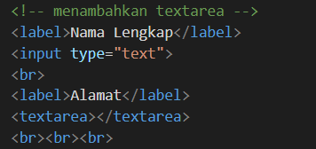 

Tampilan setelah dijalankan :
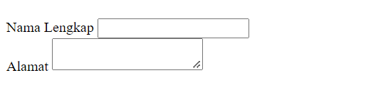 

## Menambahkan tabel dalam html
Tampilan code dalam html : 

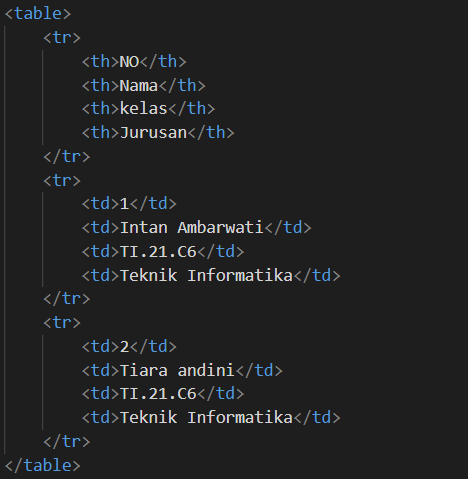 

Tampilan setelah dijalankan :
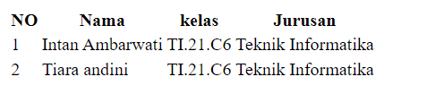 

## Menambahkan Ordered list pada html
Tampilan code dalam html : 

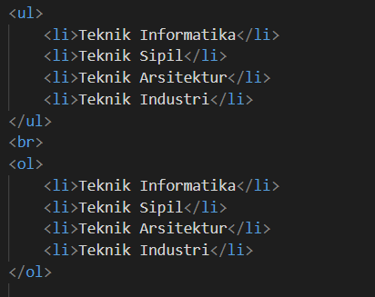 

Tampilan setelah dijalankan :
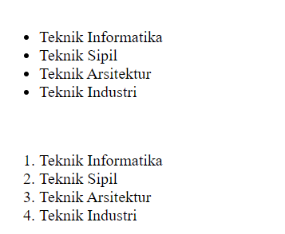 

